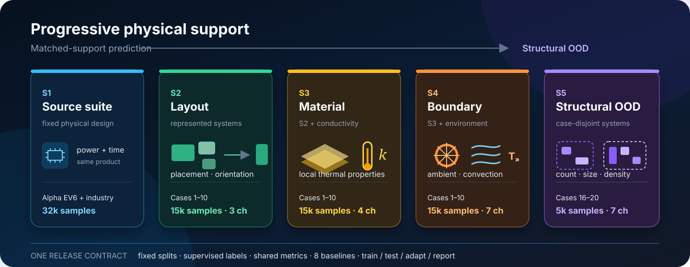

<div align="center">

# ThermalBench

### One protocol. Progressive physics. Honest OOD.

An open benchmark for reproducible, generalizable 2.5D/3D-IC thermal learning.

[](https://doi.org/10.5281/zenodo.21992816)
[](LICENSE)
[](environment.yml)
[](docs/INSTALL.md)
[](https://drive.google.com/file/d/15Do8Raf070VseV9cn44j1hdVpD3Rz-Un/view?usp=sharing)
[](docs/S1_RESULTS.md)
[](https://drive.google.com/file/d/1wisvvO19Fx9Znki651j-QWuJHVz2aPHQ/view?usp=sharing)

[**Quick start**](#quick-start) · [**Datasets**](docs/DATASETS.md) · [**S1 results**](docs/S1_RESULTS.md) · [**Reproduce**](docs/REPRODUCE.md) · [**Add a model**](docs/ADD_A_MODEL.md) · [**Paper preview**](docs/PAPER_PREVIEW.md)

</div>



Thermal prediction papers often differ in data, simulators, splits, preprocessing, and metrics, making model-to-model comparison surprisingly fragile. **ThermalBench fixes that evaluation contract.** It provides progressive physical support, immutable splits, eight baselines from three model families, and one interface for training, inference, adaptation, and reporting.

Developed and maintained by the ThermalBench research team at the **University of Technology Sydney (UTS)**.

## Why ThermalBench

Thermal learning has progressed well beyond power-only prediction: recent methods study geometry, material, cooling, and unseen systems. The remaining problem is comparability. Results are commonly produced with different private or partially released datasets, reference solvers, representations, splits, and metrics. Consequently, a lower error may reflect an easier test distribution rather than a better model, and “generalization” may refer to anything from a new power map on the same chip to a structurally unseen package.

ThermalBench does **not** claim to be the first work that varies multiple physical factors. Its role is to make those capabilities measurable under an open, model-agnostic contract.

| Work | Pub. | Method | Factors | Generalization / evaluation | Public artifact status |
|---|---|---|---|---|---|
| [ARO](https://github.com/Mia-WMY/ARO) | ICCAD'24 | autoregressive operator | P, t | fixed-design power; cross-case transfer | code + source-data link |
| [SAU-FNO](https://doi.org/10.1109/DAC63849.2025.11132988) | DAC'25 | attention U-FNO | P | fixed-design power; cross-case transfer | source data |
| [Therm-FM](https://arxiv.org/abs/2605.22663) | arXiv'26 | PDE foundation model | P, t | fixed-design HS tasks; IND transfer | data, code, checkpoints |
| FSA-Heat | DATE'25 | frequency–spatial network | G, P, M, B | in-support mixtures; unseen conductivity/source count | method-specific study |
| Therm-PCT | ICCAD'25 | point-cloud Transformer | G, P, M | unseen geometry and unstructured points | method-specific study |
| Adaptive Graph | ICCAD'25 | GNN–FEM hybrid | G, M | unseen process/material and interfaces | method-specific study |
| COOL | DAC'26 | 3D point-cloud predictor | G, P, M, B | design-disjoint multi-factor evaluation | method-specific study |
| **ThermalBench** | in preparation | 8 baselines / 3 families | G, P, M, B, t | fixed → in-support → case-disjoint structural OOD | shared data, splits, metrics, checkpoints |

`G/P/M/B/t` denote geometry or placement, power, material, boundary or cooling, and time. The table is deliberately compact: prior studies use different task definitions, so the settings are descriptive rather than numerically equivalent. Their breadth motivates ThermalBench; their incompatible evaluation contracts motivate a unified benchmark.

> **Key finding:** in-support multi-physics generalization does not imply structural generalization.

## What the benchmark reveals


| Track | Physical support | Best method | Best RMSE ↓ |
|---|---|---|---:|
| **S1** | fixed-design source tasks | **Therm-FM L** | **0.009–0.076 K**¹ |
| **S2** | represented layouts and configurations | **SAU-FNO** | **0.657 K** |
| **S3** | S2 + material conductivity | **U-FNO** | **0.802 K** |
| **S4** | S3 + ambient and cooling conditions | **U-FNO** | **1.327 K** |
| **S5 · zero-shot** | five case-disjoint chiplet systems | **Therm-FM T** | **15.99 K** |
| **S5 · 10-shot** | ten labeled samples per unseen case | **Therm-FM B** | **3.19 K** |

¹ S1 is a collection of eight source tasks, so its range is task-specific rather than one pooled score. The [complete S1 table](docs/S1_RESULTS.md) records all cases, resolutions, RMSE, and MAE under their original protocols. S2–S5 use the controlled ThermalBench protocol.

The in-support results degrade gradually as observed physical dimensions are added. The case-disjoint S5 shift is qualitatively different: error grows by roughly an order of magnitude, model rankings change, and a small amount of target supervision recovers much of the gap. See the [paper preview](docs/PAPER_PREVIEW.md) for interpretation and the [reproduction guide](docs/REPRODUCE.md) for the exact protocol.

## Benchmark at a glance

ThermalBench uses **Scope** rather than “level”: the sequence describes the capability a deployment needs, not a universal maturity rank.

| Scope | Evaluation setting | Newly variable factors | Samples | Typical use |
|---|---|---|---:|---|
| **S1 · Source suite** | fixed-design prediction | power; time for transient tasks | 32,000 | workload analysis, dynamic thermal management |
| **S2 · Layout** | in-support | placement and orientation across system templates | 15,000 | floorplanning and design-space exploration |
| **S3 · Material** | in-support | S2 + local thermal conductivity | 15,000 | material and process sweeps |
| **S4 · Boundary** | in-support | S3 + ambient temperature and convection | 15,000 | cooling and environment co-design |
| **S5 · Structural OOD** | case-disjoint | unseen chiplet counts, sizes, power-density regimes, and utilization | 5,000 | transfer to a new product or package |

### Dataset provenance and credit

- **S1 is collected, not regenerated.** ThermalBench preserves the original Alpha EV6 and industrial task definitions, simulators, resolutions, and evaluation conventions used along the [ARO](https://github.com/Mia-WMY/ARO) → [Therm-FM](https://arxiv.org/abs/2605.22663) research line. We do not alter these source tasks or pool their scores with S2–S5. The unified S1 data package and evaluation code are **on the way**; the [recorded source-suite results](docs/S1_RESULTS.md) are available now.
- **S2 follows the ATPlace2.5D lineage.** Cases 1–10, their chiplet systems, and the HotSpot-based thermal setup originate from Qipan Wang *et al.*'s [ATPlace2.5D public package](https://github.com/PKU-IDEA/ATPlace_pub). ThermalBench uses this tested foundation for its layout scope.
- **S3–S5 are consistent extensions.** They retain the S2 case/generation conventions while adding material support, boundary support, and held-out structural systems. This preserves continuity with an established placement benchmark while expanding the thermal-learning evaluation space.

The current executable release contains the generator-backed **S2–S5** data and code path. S1 remains explicitly separated until its unified package is ready.

### Eight baselines, one protocol

| Family | Baselines |
|---|---|
| Convolutional networks | U-Net |
| Neural operators | FNO, U-FNO, SAU-FNO, DeepOHeat |
| PDE foundation models | Therm-FM T / B / L |

Every baseline receives the same labeled samples, split membership, physical channels, and metric implementation. The release does not force one optimizer onto every architecture: model-specific training recipes are preserved in [`MODEL_ZOO`](exp/exp_basic.py).

## Quick start

### 1. Install

```bash
git clone https://github.com/Day333/ThermalBench.git
cd ThermalBench
conda env create -f environment.yml
conda activate thermalbench
python script/smoke_test.py
```

The frozen environment matches the released checkpoints. Therm-FM is version-sensitive; read the [installation notes](docs/INSTALL.md) before changing PyTorch, Transformers, or Accelerate.

### 2. Place data and checkpoints

Download the [datasets (~4.6 GB)](https://drive.google.com/file/d/15Do8Raf070VseV9cn44j1hdVpD3Rz-Un/view?usp=sharing) and [released checkpoints (~9.6 GB)](https://drive.google.com/file/d/1wisvvO19Fx9Znki651j-QWuJHVz2aPHQ/view?usp=sharing), then unpack them at the repository root:

```text
ThermalBench/
├── datasets/
│   ├── level2_steady/
│   ├── level3_steady/
│   ├── level4_steady/
│   └── level5_steady/
└── checkpoints/
```

The public command tokens remain `level2`–`level5` for checkpoint compatibility; they correspond to paper Scopes S2–S5.

### 3. Evaluate

```bash
# One baseline on one scope
python run.py --model UFNO --data level2 --task test

# Frozen S4 checkpoint on structural-OOD S5
python run.py --model ThermFM-T --data level5 --task test

# All 8 baselines × S2–S5, followed by one summary table
bash script/test_all.sh
```

When `--load` is omitted, S5 zero-shot evaluation automatically resolves the matching S4 checkpoint. No S5 labels or normalization updates are used.

## Train, adapt, compare

```bash
# Train one model on S2/S3/S4
bash script/UFNO/train.sh

# Ten labeled samples per unseen S5 case
python run.py --model UFNO --data level5 --task finetune --shots 10

# Run all released adaptation recipes
bash script/finetune_all.sh

# Rebuild the benchmark summary from saved metrics
python utils/summarize.py level2 level3 level4 level5
```

`run.py` is the single entry point; every command also accepts `--root_path`, `--checkpoints`, `--load`, and `--output`. Full commands, split semantics, metric definitions, and reproducibility boundaries are in [docs/REPRODUCE.md](docs/REPRODUCE.md).

## Use ThermalBench for your model

A new predictor only needs to satisfy one tensor contract:

```text
input   (B, X, Y, Z, P)
output  (B, X, Y, Z)       where X = Y = 64 and Z = 1
```

Register the constructor and training recipe once, then the existing scripts provide matched S2–S5 training, zero-shot evaluation, few-shot adaptation, and the shared metrics. The complete three-step example is in [docs/ADD_A_MODEL.md](docs/ADD_A_MODEL.md).

## Reproducibility contract

- **Data:** published tensors, physical-channel schema, and S5 case manifest.
- **Splits:** deterministic, index-based train/validation/test membership.
- **Labels:** supervised reference-temperature fields for every baseline.
- **Metrics:** one implementation for RMSE, MAE, R², MaxAE, peak-temperature error, and Top-50 MAE.
- **Recipes:** architecture-specific optimization is recorded, not retroactively homogenized.
- **Artifacts:** released checkpoints and JSON outputs can be audited without retraining.

The release is designed to be easy to reproduce **and** easy to extend: data conversion, model execution, evaluation, aggregation, and OOD adaptation all use the same repository-level interface.

## Documentation

| Guide | Contents |
|---|---|
| [Installation](docs/INSTALL.md) | exact environment, GPU notes, Therm-FM dependencies |
| [Datasets](docs/DATASETS.md) | files, shapes, channels, splits, manifests, checkpoints |
| [S1 source-suite results](docs/S1_RESULTS.md) | provenance, status, and complete eight-task result table |
| [Reproduce](docs/REPRODUCE.md) | evaluation tracks, commands, metrics, expected key results |
| [Add a model](docs/ADD_A_MODEL.md) | tensor contract, registry entry, scripts, integration checklist |
| [Paper preview](docs/PAPER_PREVIEW.md) | benchmark motivation, design, findings, and paper status |

## Current limitations

- S1 data packaging and unified evaluation scripts are still in progress; its stored values currently preserve source-reported protocols.
- S2–S5 currently cover 64×64 steady-state fields with `Z=1`; progressive transient evaluation beyond S1 remains future work.
- S2–S4 are independently generated, not sample-wise paired, so their differences measure distributional difficulty rather than a strict causal ablation.
- S5 contains five held-out systems. It reveals a substantial structural-OOD gap, but cannot represent every industrial package, process, or cooling technology.
- The benchmark is label-supervised. Physics-only and label-free training answer a different question and are not presented as directly interchangeable baselines.

## Citation

The benchmark artifacts are citable now; the paper citation will replace this software entry after public release.

```bibtex
@software{thermalbench2026,
  title     = {ThermalBench: An Open, Progressive Benchmark for Generalizable
               2.5D/3D-IC Thermal Learning},
  author    = {The ThermalBench Authors},
  year      = {2026},
  publisher = {Zenodo},
  doi       = {10.5281/zenodo.21992816},
  url       = {https://doi.org/10.5281/zenodo.21992816},
  note      = {Paper in preparation}
}
```

## License and acknowledgements

ThermalBench is released under the [MIT License](LICENSE). The vendored `model/scOT/` code retains its upstream license. We thank the authors of [ARO](https://github.com/Mia-WMY/ARO), [Therm-FM](https://arxiv.org/abs/2605.22663), and [ATPlace2.5D](https://github.com/PKU-IDEA/ATPlace_pub), as well as the HotSpot, Poseidon/scOT, FNO, U-FNO, and DeepOHeat communities. Their public artifacts and source tasks make a shared thermal-learning benchmark possible.
