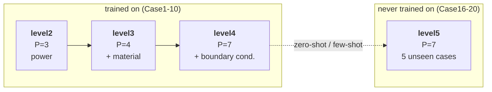

# ThermalBench: An Open, Progressive Benchmark for Generalizable 2.5D/3D-IC Thermal Learning

<p align="center">
  <a href="LICENSE"></a>
  
  
  <br>
  
  
  
  <a href="https://drive.google.com/file/d/15Do8Raf070VseV9cn44j1hdVpD3Rz-Un/view?usp=sharing"></a>
  <a href="https://drive.google.com/file/d/1wisvvO19Fx9Znki651j-QWuJHVz2aPHQ/view?usp=sharing"></a>
  
</p>

An operator-learning benchmark for chip thermal simulation under a single shared data
split and a single shared metric implementation — 8 models across 4 datasets of
increasing difficulty, covering training, evaluation and few-shot extrapolation
fine-tuning from one entry point.

**Progressive** — input channels grow from P=3 to P=7 (power → material → boundary
conditions), forming a four-level difficulty gradient.
**Generalizable** — the final level swaps in five brand-new cases as a pure
extrapolation set, measuring generalization rather than fit.
**Open** — code, datasets and model checkpoints are all released.

Developed and maintained by a research team from the University of Technology Sydney (UTS).



---

## News

- **[2026-08]** Benchmark code and data finalized; all results for 8 models across
  level2–level5 have been reproduced and verified.
- **[Coming soon]** The paper **ThermalBench: An Open, Progressive Benchmark for
  Generalizable 2.5D/3D-IC Thermal Learning** has not been released yet. The arXiv link
  and the formal citation will be added here once it is public.

---

## Highlights

- **One shared protocol** — all 8 models use the same data split (`train_ratio=0.8`,
  then 9:1 for val) and the **same metric function** (`utils/metrics.py`). Numbers are
  directly comparable across models; nobody computes their own variant.
- **One entry point** — `python run.py --model X --data levelN --task train|test|finetune`
  covers every model, including Therm-FM with its HuggingFace Trainer multi-GPU pipeline.
- **Four difficulty levels** — input channels grow from P=3 to P=7 (power → material →
  boundary conditions); the last level is a **pure extrapolation set built from five
  brand-new cases**, designed to measure generalization rather than fit.
- **Few-shot extrapolation** — fine-tune with only K labelled samples per case and get
  per-epoch curves for all six metrics.
- **Reproducible** — loading historical weights with this code reproduces the original
  records to 6 decimal places (see [Reproducibility](#reproducibility)).
- **Easy to extend** — adding your own model means editing `MODEL_ZOO` in one place;
  see [Adding Your Own Model](#adding-your-own-model).

---

## Code, Datasets, Model Checkpoints

| Resource | Status | Download |
|---|---|---|
| Code | ✅ Released | This repository |
| Datasets | ✅ Released | [Google Drive](https://drive.google.com/file/d/15Do8Raf070VseV9cn44j1hdVpD3Rz-Un/view?usp=sharing) — level2–level5, `.mat`, ~4.6 GB |
| Model Checkpoints | ✅ Released | [Google Drive](https://drive.google.com/file/d/1wisvvO19Fx9Znki651j-QWuJHVz2aPHQ/view?usp=sharing) — 24 checkpoints (8 models × level2/3/4), ~9.6 GB |

The Poseidon pretrained weights required for Therm-FM training come from upstream:
[camlab-ethz](https://huggingface.co/camlab-ethz).

---

## Installation

### Dependencies

These are the exact versions the benchmark was produced with. **Do not upgrade casually** —
the interface between `transformers` 4.29.2 and `accelerate` changed in later releases,
and Therm-FM runs on HuggingFace Trainer, so a version bump will most likely break it
outright.

| Package | Version | Purpose |
|---|---|---|
| python | 3.10 | |
| torch | 2.0.1+cu118 | CUDA 11.8 |
| transformers | 4.29.2 | required by Therm-FM (scOT), **version sensitive** |
| accelerate | 0.31.0 | Therm-FM multi-GPU DDP |
| h5py | 3.16.0 | reading `.mat` |
| numpy | 1.26.4 | |
| pandas | 2.3.3 | CSV conversion script |
| scikit-learn | 1.7.2 | `r2_score` used by FNO |
| pyyaml | 6.0.3 | Therm-FM configs |
| matplotlib | 3.10.9 | visualization (optional) |
| psutil | | used internally by scOT |
| wandb | 0.27.2 | offline logging only |

```bash
conda create -n thermbench python=3.10 -y
conda activate thermbench
pip install torch==2.0.1+cu118 --index-url https://download.pytorch.org/whl/cu118
pip install transformers==4.29.2 accelerate==0.31.0 \
            h5py numpy==1.26.4 pandas scikit-learn pyyaml matplotlib psutil wandb
```

Verify:

```bash
python -c "import torch, transformers, accelerate, h5py; \
print(torch.__version__, torch.cuda.is_available(), transformers.__version__)"
```

The scripts call `python` from PATH. If your interpreter is elsewhere, override it with
`PY=/path/to/python bash script/...`.

### GPU

| Model | GPUs | Memory |
|---|:--:|---|
| FNO / UFNO / SAUFNO / UNet / DeepONet | 1 | < 12 GB |
| ThermFM-T / ThermFM-B | 4 | ~20 GB per GPU |
| ThermFM-L | 4 | ~40 GB per GPU |

⚠️ Therm-FM's `batch_size=40` is defined as the total across **4 GPUs**. Changing the GPU
count changes the effective batch size, and the results stop being comparable to the
benchmark. The reference numbers were produced on RTX A6000 (48 GB).

### Offline environments

`WANDB_MODE=offline` is already set by default on the Therm-FM path
(`exp/exp_thermfm.py`); without it the run stalls retrying network calls. When running
the other models by hand without internet access, export it yourself.

---

## Repository Structure

```
ThermalBench/
├── run.py                    single entry point
├── data_provider/
│   ├── data_loader.py        .mat loading and the train/val/test split
│   └── data_factory.py       dataset resolution; special case for pure eval sets
├── layers/                   spectral convolutions, U-Net blocks, axial attention,
│                             normalizers, FNO's bundled Adam
├── model/
│   ├── FNO.py  UFNO.py  SAUFNO.py  UNet.py  DeepONet.py
│   ├── scOT/                 vendored Therm-FM backbone (verbatim from upstream)
│   └── thermfm_configs/      the 9 Therm-FM yaml configs
├── exp/
│   ├── exp_basic.py          model registry MODEL_ZOO (all training recipes live here)
│   ├── exp_operator.py       training and evaluation for the FNO family / UNet / DeepONet
│   ├── exp_thermfm.py        Therm-FM (HF Trainer + accelerate)
│   └── exp_fewshot.py        level5 few-shot fine-tuning
├── utils/
│   ├── metrics.py            the **only** metric implementation
│   ├── losses.py  tools.py  compat.py  summarize.py
├── script/                   one folder per model + three top-level entry points
├── datasets/                 ← placed separately
├── checkpoints/              ← training output and released weights
└── pretrained/               ← Poseidon-T/B/L (https://huggingface.co/camlab-ethz),
                                only needed to train Therm-FM
```

---

## Datasets

Unpack into `datasets/` and they are ready to use — **no preprocessing required**.

```
datasets/
├── level2_steady/   input.mat  output.mat                  P=3   15000  Case1–10 × 1500
├── level3_steady/   input.mat  output.mat                  P=4   15000  Case1–10 × 1500
├── level4_steady/   input.mat  output.mat                  P=7   15000  Case1–10 × 1500
└── level5_steady/   input.mat  output.mat  manifest.json   P=7    5000  Case16–20 × 1000
```

| `--data` | P | Input channels (in C-axis order) | Role |
|---|:--:|---|---|
| `level2` | 3 | `chiplet_power, grid_x, grid_y` | training |
| `level3` | 4 | above + `local_thermal_k` | training |
| `level4` | 7 | above + `ambient_K, h_w_m2k, r_convec_k_per_w` | training |
| `level5` | 7 | same as level4 | **pure extrapolation**, never trained on |

Tensor format:

```
input.mat   ["data"]  (B, P, Z, Y, X)  float32   Z=1, Y=X=64
output.mat  ["data"]  (B,    Z, Y, X)  float32   temperature in K
manifest.json         one {case, file} record per sample
                      level5 only; drives per-case metrics and few-shot grouping
```

If the data lives elsewhere, point at it explicitly:

```bash
python run.py --model UFNO --data level2 --task test \
       --root_path /path/to/data --checkpoints /path/to/ckpt
```

To regenerate from the raw CSVs, see `datasets/tools/convert_csv_to_mat.py`.

---

## Model Checkpoints

```
checkpoints/
├── level2_UFNO/model.pt                  operator models: {x_norm, model, y_norm} or a state_dict
├── level2_ThermFM-T/                     scOT directory: config.json + pytorch_model.bin + …
└── fewshot/level5_UFNO_k10.json          few-shot curves
```

`--task test` resolves this layout automatically when `--load` is omitted.

| Model | Parameters |
|---|---:|
| FNO | 11,974,721 |
| UFNO | 5,103,905 |
| SAUFNO | 5,130,725 |
| UNet | 5,060,037 |
| DeepONet | 3,721,985 |
| ThermFM-T | ~20.7 M |
| ThermFM-B | ~157.6 M |
| ThermFM-L | ~628.4 M |

Counts are measured on level2 (P=3) and vary slightly with the number of input channels.

---

## Evaluation

```bash
# one model, one dataset
python run.py --model UFNO --data level2 --task test

# one model, every dataset
bash script/UFNO/test.sh

# all 8 models × level2/3/4/5, then print the summary table
bash script/test_all.sh
```

**How level5 is evaluated**: it swaps in five brand-new cases and is never trained on.
When `--load` is omitted, the **level4 weights are picked up automatically** for
zero-shot prediction:

```bash
python run.py --model UFNO      --data level5 --task test
python run.py --model ThermFM-T --data level5 --task test
```

`test_all.sh` calls `utils/summarize.py` when it finishes to print the six-metric summary
table. It can also be run on its own:

```bash
python utils/summarize.py            # everything
python utils/summarize.py level2 level5
```

---

## Training and Fine-tuning

### Training

```bash
python run.py --model UFNO      --data level2 --task train
python run.py --model ThermFM-T --data level4 --task train --gpus 0,1,2,3

bash script/UFNO/train.sh              # train on level2/3/4
bash script/UFNO/train.sh level2       # train on level2 only
bash script/train_all.sh               # all 8 models
```

⚠️ **Therm-FM is fine-tuned from Poseidon, not trained from scratch.** It needs
`pretrained/Poseidon-{T,B,L}/` in place; without them you can only evaluate existing
weights. The other seven models do not need it.

### Few-shot fine-tuning

Zero-shot error on level5 is large. Few-shot answers the question: given only a handful
of labelled samples per case, how much of that gap can be recovered?

```bash
python run.py --model UFNO --data level5 --task finetune --shots 10
bash script/UFNO/finetune.sh 10 50
bash script/finetune_all.sh
```

The split, grouped by case from the manifest and preserving order within a group:

```
first 500 per case → fine-tuning pool; K-shot takes its first K   (5K training samples)
last  500 per case → held-out evaluation set, shared by every K   (2500, zero overlap)
```

⚠️ **The learning rate defaults to one tenth of each model's own training lr, not one
shared value.** That is 1e-4 for the operator family and **5e-6** for Therm-FM — the
latter diverges outright at 1e-4 (measured RMSE 16.01 → 31.34, collapsing within a single
epoch) because it trains at only 5e-5. The defaults live in `MODEL_ZOO` as `finetune_lr`
and can be overridden with `--lr`.

Results are written to `checkpoints/fewshot/{data}_{model}_k{K}.json`, containing a
per-epoch `curve` (all six metrics) plus `final` and `baseline`.

---

## Configurations

Every model's **training recipe** lives in `MODEL_ZOO` in `exp/exp_basic.py`. The
differences below are all real; do not "tidy them up" into a uniform config:

| Model | Epochs | Optimizer | Schedule | Notes |
|---|:--:|---|---|---|
| FNO | 100 | **bundled Adam**, wd=1e-4 | StepLR(2, 0.9) | dropout off; training loop stays in `model/FNO.py` |
| UFNO | 100 | Adam, wd=1e-4, `foreach=False` | StepLR(2, 0.9) | |
| SAUFNO | 100 | same as above | same as above | subclasses U-FNO's `SimpleBlock3d` |
| UNet | **200** | Adam, **no wd** | **none** | |
| DeepONet | 100 | Adam, wd=1e-4 | StepLR(2, 0.9) | |
| ThermFM-T/B/L | 200 | HF Trainer + accelerate | cosine | 4 GPUs; configured in yaml |

Therm-FM's configs are `model/thermfm_configs/run_level{2,3,4}_steady_{T,B,L}.yaml` and
hold `lr`, `batch_size`, `num_epochs`, `train_ratio` and so on. `--epochs` and
`--num_trajectories` write a temporary config that overrides the matching entries; when
they are not passed, the benchmark config is used byte for byte.

---

## Results

Full benchmark results (all 8 models x level2-level5, six metrics each) will be released
together with the paper.

To reproduce them yourself once the datasets and checkpoints are in place:

```bash
bash script/test_all.sh          # evaluates everything, then prints the summary table
python utils/summarize.py        # re-print the table from results/
```

---

## Adding Your Own Model

Three steps, using a model called `MyNet` as the example.

**1. Write the model** → `model/MyNet.py`

Shape contract: input `(B, X, Y, Z, P)`, output `(B, X, Y, Z)`. X=Y=64, Z=1;
**do not hardcode P** — the same model has to run on the P=3/4/7 datasets.

```python
import torch.nn as nn


class MyNet(nn.Module):
    def __init__(self, in_channels, width=64):
        super().__init__()
        self.net = nn.Sequential(
            nn.Conv2d(in_channels, width, 3, padding=1), nn.GELU(),
            nn.Conv2d(width, 1, 3, padding=1),
        )

    def forward(self, x):                                  # (B, X, Y, Z, P)
        b, nx, ny, nz, p = x.shape
        h = x.reshape(b, nx, ny, p).permute(0, 3, 1, 2)    # -> (B, P, X, Y)
        return self.net(h).permute(0, 2, 3, 1)             # -> (B, X, Y, Z)
```

**2. Register it** → add one entry to `MODEL_ZOO` in `exp/exp_basic.py`

```python
"MyNet": dict(
    prefix="mynet",                 # metric-key prefix; must not collide
    epochs=100, batch_size=20,
    lr=1e-3, weight_decay=1e-4, sched=("step", 2, 0.9),
    finetune_lr=1e-4,               # few-shot; one tenth of the lr above
    build=lambda P, Z, G: ("model.MyNet:MyNet", dict(in_channels=P)),
),
```

This is the only place that needs editing — classes are imported from a
`"module:ClassName"` string, so there is no second import branch to patch.

**3. Add the scripts** → derive them from an existing model, three lines each

```bash
mkdir -p script/MyNet
for t in train test finetune; do
  sed "s/^MODEL=.*/MODEL=MyNet/" script/UFNO/$t.sh > script/MyNet/$t.sh
done
chmod +x script/MyNet/*.sh
```

Done:

```bash
bash script/MyNet/train.sh          # train on level2/3/4
bash script/MyNet/test.sh           # evaluate on level2/3/4/5
bash script/MyNet/finetune.sh 10 50
```

**What you get for free**: the case-balanced data split, per-channel normalization, all
six metrics, checkpoint save/load, level5 zero-shot extrapolation, few-shot fine-tuning
curves, and the summary table — none of which you have to write.

⚠️ **Both level5 evaluation and level5 fine-tuning need the level4 weights first.**
Training only on level2 and then evaluating level5 raises "no checkpoint". Running
`script/MyNet/train.sh` without arguments trains level2/3/4 and avoids this.

### If your tensor layout differs

The example reshapes inside the model, which is the least work. To let the framework do
it instead (as UNet does), add a branch to each of `_to_model`, `_from_model` and
`_model_out_for_loss` in `exp/exp_operator.py`. **All three must be changed together** —
patching only the first two makes the shape fed to the loss during training disagree with
the one used at evaluation.

### If your training loop differs

Set `builtin_loop=True` in the registry and implement on the model class:

```python
def train_model(self, x_train, y_train, epochs, batch_size, work_dir,
                epoch_log_fn=None, x_val=None, y_val=None, **kw):
    ...
    return x_normalizer, y_normalizer, folder
```

FNO does exactly this (it uses the repo's bundled Adam); copy `model/FNO.py`.

### Joining train_all / test_all

Add the model name to the `QUEUE_A` / `QUEUE_B` arrays in `script/train_all.sh`, and to
the two for-loop lists in `test_all.sh` and `finetune_all.sh`. The summary table's
ordering lives in `ORDER` in `utils/summarize.py`.

---

## Notes & Pitfalls

Every item below was hit in practice. Read before changing anything here.

### The split

```
test  = last 20% of everything   (train_ratio = 0.8)
train = first 90% of the leading 80%
val   = last 10% of the leading 80%
```

It slices by index and does not shuffle. The datasets are stored case-interleaved
(`c1s1, c2s1, …, c10s1, c1s2, …`) precisely so that all three segments stay case-balanced
(train 1080/case, val 120/case, test 300/case).

⚠️ With a `.mat` stacked by case instead, train would contain no Case10 at all while test
would be entirely Case10 — a model evaluated on a case it never saw. **Pure extrapolation
sets (level5) are stacked by case, so they skip this split entirely and the whole set is
used for evaluation** (`data_provider.PURE_EVAL`); otherwise only the last case's 1000
samples would be scored.

### Metrics

All six reported metrics come from the **same function** in `utils/metrics.py`. Do not
write a second "equivalent" implementation:

| Reported as | Dictionary key | Meaning |
|---|---|---|
| RMSE↓ | `{prefix}/rmse` | per-sample RMSE, then averaged |
| MAE↓ | `{prefix}/mean_absolute_error` | |
| R²↑ | `{prefix}/r2` | **pooled** over all pixels at once |
| MaxAE↓ | `{prefix}/max_absolute_error` | worst single-pixel error in the field |
| T_max err↓ | `{prefix}/max_temperature_error` | \|predicted peak − true peak\| |
| Top-MAE↓ | `{prefix}/topk50_temperature_difference` | MAE over the 50 hottest true points |

R² is pooled rather than averaged per sample: fields with near-zero spatial variance drive
the per-sample R² to −∞ and drag the mean negative.

### Normalization

`--per_channel_norm 1` (default). **Required for the P=7 level4/level5**: under a single
global scalar, `r_convec` has a std of only 6.7e-6 against 1.93 for `h` — a factor of
2.9e5 — which crushes the small-magnitude channels into numerical noise, and `r_convec`
happens to be the input most correlated with temperature level (corr +0.728).

### The call order must not change

`set_seed → load data → build normalizers → build model → build DataLoader`. Model
initialization consumes RNG, and `shuffle=True` consumes RNG. Move any step and both the
initial weights and the batch order change, so training stops reproducing.

### Two Therm-FM traps

**`TFM_LAST_EPOCH=1`** (set by default): scOT picks the best checkpoint by validation
loss, but under this project's split that selects a badly undertrained epoch-2 model
(measured RMSE 8.83, versus ~0.5 for the final epoch). Setting it to 1 uses the last epoch
and **also skips** `EarlyStoppingCallback` — HF's callback asserts
`load_best_model_at_end=True`, so disabling only the former makes every DDP child exit
within 12 seconds.

**Test segment selected by index**: scOT's `ThermalSteady3D` treats only the trailing 20%
as test. This project adds two switches to the vendored class, set automatically by the
`exp/` layer so users never see them:

| Environment variable | Effect |
|---|---|
| `TFM_EVAL_ALL=1` | test segment = all samples, original order |
| `TFM_EVAL_INDICES=<json>` | test segment = the index list in that json |

Upstream worked around the limitation by tiling the data 5×, which cost every user an
extra 4.7 GB and one more preprocessing step. Selecting by index needs no copies, and the
two paths have been verified to agree on all six metrics to 7–8 significant figures.

### Two deliberate inconsistencies

This project merged five independent scripts into one pipeline, but two things were left
as they were, because unifying them would break reproduction:

1. **FNO's training loop stays in `model/FNO.py`.** It uses the bundled
   `layers/optim.py` (not `torch.optim.Adam`) along with its own validation logic, and
   evaluation takes a separate path (float64 forward, denormalization on the GPU).
2. **Therm-FM runs on HuggingFace Trainer + accelerate.** `exp/exp_thermfm.py` only
   assembles arguments and launches processes; the training loop remains the vendored
   `model/scOT/`.

<a name="reproducibility"></a>
### Reproducibility

Loading historical weights with this code and comparing against the original records:

| Scope | Result |
|---|---|
| UNet / DeepONet / FNO × level2/3/4 | 9 entries bit-identical |
| U-FNO / SAU-FNO × level2/3/4 | 6 entries, one metric each differing by ≤8.3e-6 relative |
| Therm-FM T/B × level2 | identical to 10 decimal places |
| few-shot baseline (U-FNO level5) | all six metrics within ≤8e-7 |

The non-zero differences come from float32 forward-pass noise caused by cuDNN choosing
different algorithms on different GPUs, not from logic differences — RMSE, MAE and R² all
agree to 6 decimal places.

**Retraining from scratch will not reproduce bit-for-bit**, for the same GPU
non-determinism, at a magnitude below 1e-2. Model comparisons should look for gaps above
that noise floor.

---

## Relationship to Prior Work

This benchmark unifies the implementations below. Model classes are **copied verbatim**,
with only import paths adjusted:

- **FNO** — Li et al., *Fourier Neural Operator for Parametric Partial Differential
  Equations*. Includes the Adam implementation bundled with that repository.
- **U-FNO** — Wen et al.; each Fourier layer runs in parallel with a small U-Net.
- **SAU-FNO** — axial self-attention inserted after U-FNO's last U-Fourier layer;
  everything else is inherited unchanged from U-FNO, which is what makes the comparison
  fair.
- **DeepONet** — derived from DeepOHeat, switched to MSE supervision (the original uses a
  PDE residual), with query points fixed to the 64×64 grid.
- **Therm-FM / scOT / Poseidon** — Therm-FM is fine-tuned from Poseidon's scOT backbone.
  `model/scOT/` is vendored verbatim from upstream to keep future syncs straightforward.

---

## Citation

The paper has not been released yet. This section will be replaced with the formal BibTeX
(authors, venue and DOI) once it is public. In the meantime:

```bibtex
@misc{thermalbench2026,
  title  = {ThermalBench: An Open, Progressive Benchmark for Generalizable
            2.5D/3D-IC Thermal Learning},
  note   = {Preprint in preparation},
  year   = {2026}
}
```

---

## Acknowledgements

We thank the Poseidon / scOT authors for open-sourcing their PDE foundation-model
framework, the HotSpot thermal simulator for the ground-truth data, and the original
authors of FNO, U-FNO and DeepOHeat for their open implementations, on which the
comparisons in this benchmark are built.

---

## License

MIT License, see [LICENSE](LICENSE). The vendored `model/scOT/` retains its upstream
license.
