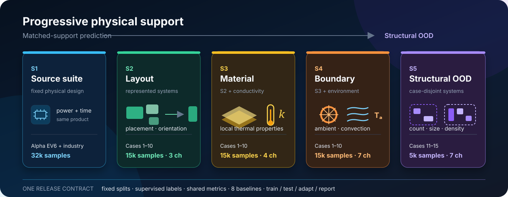
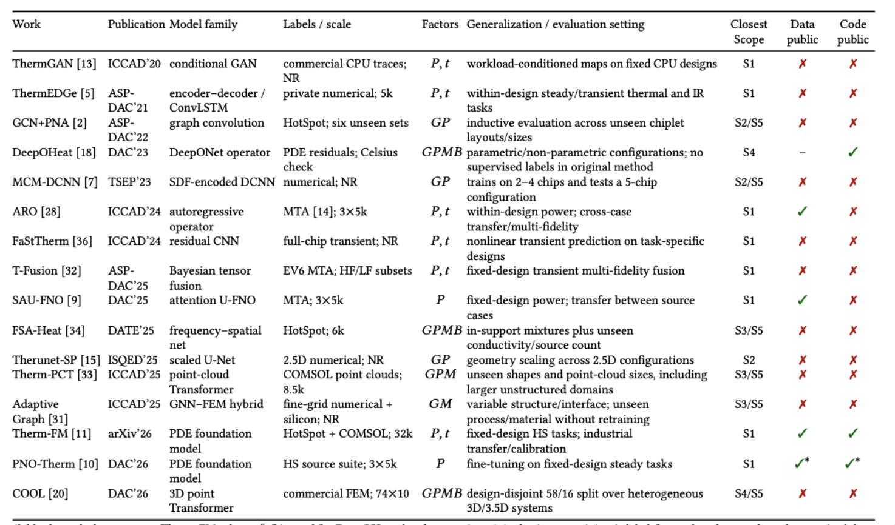
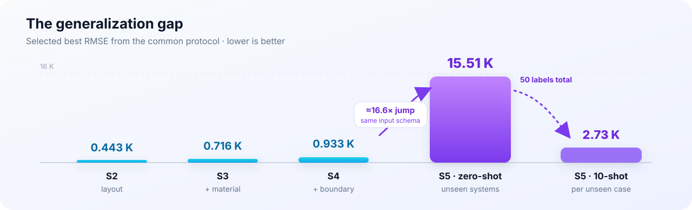

<div align="center">

# IC-ThermBench

[**English**](README.md) · **简体中文**

面向可复现、可泛化 2.5D/3D-IC 热学习的开放基准。

[](https://doi.org/10.5281/zenodo.21992816)
[](LICENSE)
[](LICENSE-DATA)
[](environment.yml)
[](docs/INSTALL.md)
[](https://drive.google.com/file/d/15Do8Raf070VseV9cn44j1hdVpD3Rz-Un/view?usp=sharing)
[](docs/RESULTS.md)
[](https://drive.google.com/file/d/1wisvvO19Fx9Znki651j-QWuJHVz2aPHQ/view?usp=sharing)

[**快速开始**](#快速开始) · [**数据集**](docs/DATASETS.md) · [**实验结果**](docs/RESULTS.md) · [**复现实验**](docs/REPRODUCE.md) · [**接入新模型**](docs/ADD_A_MODEL.md) · [**论文预览**](docs/PAPER_PREVIEW.md)

</div>



热预测论文往往采用不同的数据、仿真器、划分方式、预处理与指标，导致模型之间难以公平比较。**IC-ThermBench 固定了这套评测契约**：提供渐进式物理变量覆盖、不可变数据划分、来自三类模型家族的八个 baseline，以及统一的训练、推理、适配和结果汇总接口。

本项目由 **悉尼科技大学（University of Technology Sydney, UTS）** IC-ThermBench 研究团队开发和维护。

## 为什么需要 IC-ThermBench

已有工作已经研究了几何、材料、散热条件和未见系统；目前真正缺少的是统一、开放且可复现的比较方式。不同论文通常使用私有或不完整公开的数据集、求解器、输入表示、数据划分与指标。因此，更低的误差可能来自更容易的测试分布，而“泛化”也可能分别指同一芯片上的新功率图，或结构完全未见的新封装。



图中 `G/P/M/B/t` 分别表示几何或布局、功率、材料、边界或散热条件以及时间。“Closest Scope”仅表示近似能力对应关系，并不表示不同数据集或划分方式完全等价。

## 核心结果



| 评测轨道 | 物理变量覆盖 | 最佳方法 | 最佳 RMSE ↓ |
|---|---|---|---:|
| **S1** | 固定设计的来源任务 | **Therm-FM L** | **0.009–0.076 K**¹ |
| **S2** | 训练分布支持的布局与配置 | **SAU-FNO** | **0.657 K** |
| **S3** | S2 + 材料热导率 | **U-FNO** | **0.802 K** |
| **S4** | S3 + 环境温度与散热条件 | **U-FNO** | **1.327 K** |
| **S5 · zero-shot** | 五个 case-disjoint 芯粒系统 | **Therm-FM T** | **15.99 K** |
| **S5 · 10-shot** | 每个未见案例使用十个标签 | **Therm-FM B** | **3.19 K** |

¹ S1 收集了八个来源任务，因此这里给出各任务的结果范围，而不是混合后的单一分数。完整说明见[实验结果](docs/RESULTS.md)。S2–S5 统一使用 IC-ThermBench 协议。

随着域内可变物理维度增加，模型误差逐步上升；到了 case-disjoint 的 S5，误差会出现数量级增长，模型排名也会变化。少量目标域标签能够显著缩小这一差距，但少样本适配与真正的 zero-shot 结构泛化仍应分开报告。

## Benchmark 概览

IC-ThermBench 使用 **Scope** 而不是 “level”：这组 Scope 描述部署场景所需的能力，而不是模型成熟度的统一等级。

| Scope | 评测设置 | 新增可变因素 | 样本数 | 代表性场景 |
|---|---|---|---:|---|
| **S1 · 来源任务集** | 固定设计预测 | 功率；瞬态任务中的时间 | 32,000 | 工作负载分析、动态热管理 |
| **S2 · 布局** | 域内泛化 | 不同系统模板下的位置与方向 | 15,000 | 布图规划、设计空间探索 |
| **S3 · 材料** | 域内泛化 | S2 + 局部热导率 | 15,000 | 材料与工艺扫描 |
| **S4 · 边界条件** | 域内泛化 | S3 + 环境温度与对流系数 | 15,000 | 散热与环境协同设计 |
| **S5 · 结构 OOD** | case-disjoint | 未见芯粒数量、尺寸、功率密度范围与利用率 | 5,000 | 迁移至新产品或新封装 |

### 数据来源与致谢

- **S1 是对已有公开任务的整理，而非重新生成。** 我们保留 [ARO](https://github.com/Mia-WMY/ARO) → [Therm-FM](https://arxiv.org/abs/2605.22663) 路线中 Alpha EV6 与工业案例原有的任务定义、仿真器、分辨率和评测方式。统一的 S1 数据包与评测代码仍在准备中，现有结果已记录在[实验结果](docs/RESULTS.md)中。
- **S2 延续 ATPlace2.5D 数据路线。** Cases 1–10、芯粒系统及基于 HotSpot 的热设置来源于 Qipan Wang 等人的 [ATPlace2.5D 开源项目](https://github.com/PKU-IDEA/ATPlace_pub)。
- **S3–S5 是保持生成规范一致的扩展。** 它们在 S2 基础上依次加入材料、边界条件和结构未见系统，从而兼顾数据连续性、广度与新颖性。

当前可执行版本包含由生成器支持的 **S2–S5** 数据及完整代码路径。S1 在统一数据包完成前保持独立。

### 八个 baseline，一套协议

| 模型家族 | Baseline |
|---|---|
| 卷积神经网络 | U-Net |
| 神经算子 | FNO、U-FNO、SAU-FNO、DeepOHeat |
| PDE 基础模型 | Therm-FM T / B / L |

所有 baseline 使用相同的标签样本、数据划分、物理输入通道和指标实现；同时保留各模型自己的优化配方，具体配置见 [`MODEL_ZOO`](exp/exp_basic.py)。

对于 DeepOHeat，我们报告使用标签的全监督训练结果，而不是无标签物理残差训练，以保证与其他全监督 baseline 的公平比较。在我们的测试中，全监督版本的精度也显著更高，训练更加稳定。

## 快速开始

### 1. 安装

```bash
git clone https://github.com/Day333/IC-ThermBench.git
cd IC-ThermBench
conda env create -f environment.yml
conda activate ic-thermbench
python script/smoke_test.py
```

冻结环境与已发布 checkpoint 保持一致。Therm-FM 对版本较敏感，修改 PyTorch、Transformers 或 Accelerate 前请阅读[安装说明](docs/INSTALL.md)。

### 2. 放置数据和模型权重

下载[数据集（约 4.6 GB）](https://drive.google.com/file/d/15Do8Raf070VseV9cn44j1hdVpD3Rz-Un/view?usp=sharing)和[模型权重（约 9.6 GB）](https://drive.google.com/file/d/1wisvvO19Fx9Znki651j-QWuJHVz2aPHQ/view?usp=sharing)，解压至仓库根目录：

```text
IC-ThermBench/
├── datasets/
│   ├── level2_steady/
│   ├── level3_steady/
│   ├── level4_steady/
│   └── level5_steady/
└── checkpoints/
```

为保持 checkpoint 兼容性，命令行参数仍使用 `level2`–`level5`，分别对应论文中的 S2–S5。

### 3. 评测

```bash
# 在一个 Scope 上评测一个 baseline
python run.py --model UFNO --data level2 --task test

# 使用冻结的 S4 checkpoint 进行 S5 结构 OOD 测试
python run.py --model ThermFM-T --data level5 --task test

# 评测 8 个 baseline × S2–S5，并生成汇总表
bash script/test_all.sh
```

当未指定 `--load` 时，S5 zero-shot 评测会自动加载对应的 S4 checkpoint，不使用 S5 标签，也不会更新归一化统计量。

## 训练、适配与比较

```bash
# 在 S2/S3/S4 上训练一个模型
bash script/UFNO/train.sh

# 每个未见 S5 案例使用十个标签进行适配
python run.py --model UFNO --data level5 --task finetune --shots 10

# 执行所有已发布的少样本适配配置
bash script/finetune_all.sh

# 根据保存的指标重新生成汇总结果
python utils/summarize.py level2 level3 level4 level5
```

`run.py` 是统一入口。完整命令、数据划分语义、指标定义和复现边界见[复现实验说明](docs/REPRODUCE.md)。

## 接入你的模型

新模型只需满足统一张量接口：

```text
input   (B, X, Y, Z, P)
output  (B, X, Y, Z)       其中 X = Y = 64，Z = 1
```

注册模型构造函数与训练配方后，现有脚本即可提供一致的 S2–S5 训练、zero-shot 评测、few-shot 适配与指标计算。完整示例见[接入新模型](docs/ADD_A_MODEL.md)。

## 可复现性约定

- **数据：** 已发布张量、物理通道定义及 S5 案例清单。
- **划分：** 确定且基于索引的训练集、验证集和测试集。
- **标签：** 所有 baseline 均使用参考温度场监督。
- **指标：** 统一实现 RMSE、MAE、R²、MaxAE、最高温度误差和 Top-50 MAE。
- **训练配方：** 记录各架构自己的优化设置，而不是强行使用相同优化器。
- **产物：** 可直接检查已发布 checkpoint 与 JSON 输出，无需重新训练。

## 文档

详细技术文档目前保持英文，以避免不同语言版本出现协议偏差：

| 文档 | 内容 |
|---|---|
| [安装说明](docs/INSTALL.md) | 环境、GPU 配置及 Therm-FM 依赖 |
| [数据集](docs/DATASETS.md) | 文件、形状、通道、划分、清单和 checkpoint |
| [实验结果](docs/RESULTS.md) | S1 来源任务、S2–S4 域内结果、S5 zero-shot 与适配 |
| [复现实验](docs/REPRODUCE.md) | 评测轨道、命令、指标及关键预期结果 |
| [接入新模型](docs/ADD_A_MODEL.md) | 张量接口、模型注册、脚本和集成检查清单 |
| [论文预览](docs/PAPER_PREVIEW.md) | Benchmark 动机、设计、发现与论文状态 |

## 当前局限

- S1 数据打包与统一评测脚本仍在准备中；当前保存值沿用来源论文的评测协议。
- S2–S5 目前覆盖 `Z=1` 的 64×64 稳态温度场；S1 以外的渐进式瞬态评测仍属于未来工作。
- S2–S4 独立生成，并非逐样本配对，因此 Scope 间差异表示分布难度，而非严格的因果消融。
- S5 包含五个未见系统，能够揭示结构 OOD 差距，但无法覆盖所有工业封装、工艺或散热技术。
- 本基准使用标签监督；仅物理约束或无标签训练回答的是不同问题，不应直接混为同一类 baseline。

## 引用

Benchmark 产物目前可以引用；论文公开后将使用正式论文引用替换下面的软件条目。

```bibtex
@software{icthermbench2026,
  title     = {IC-ThermBench: An Open, Progressive Benchmark for Generalizable
               2.5D/3D-IC Thermal Learning},
  author    = {The IC-ThermBench Authors},
  year      = {2026},
  publisher = {Zenodo},
  doi       = {10.5281/zenodo.21992816},
  url       = {https://doi.org/10.5281/zenodo.21992816},
  note      = {Paper in preparation}
}
```

## 许可证与致谢

- 仓库代码使用 [MIT License](LICENSE)。
- 原创 IC-ThermBench S2–S5 数据、固定划分及发布结果采用 [CC BY 4.0](LICENSE-DATA)，欢迎在注明来源的前提下使用和扩展。
- S1 来源数据与第三方组件沿用各自原始许可证；论文及来自论文的文字、图片和表格不作为数据内容重新授权。

具体边界与署名方式见[许可证说明](LICENSES.md)。开放许可允许合理使用，但不允许将本 benchmark、论文文字或数据整理工作冒充为他人的贡献。

感谢 [ARO](https://github.com/Mia-WMY/ARO)、[Therm-FM](https://arxiv.org/abs/2605.22663) 和 [ATPlace2.5D](https://github.com/PKU-IDEA/ATPlace_pub) 的作者，以及 HotSpot、Poseidon/scOT、FNO、U-FNO 与 DeepOHeat 社区。正是这些公开产物和来源任务，使统一热学习 benchmark 成为可能。
